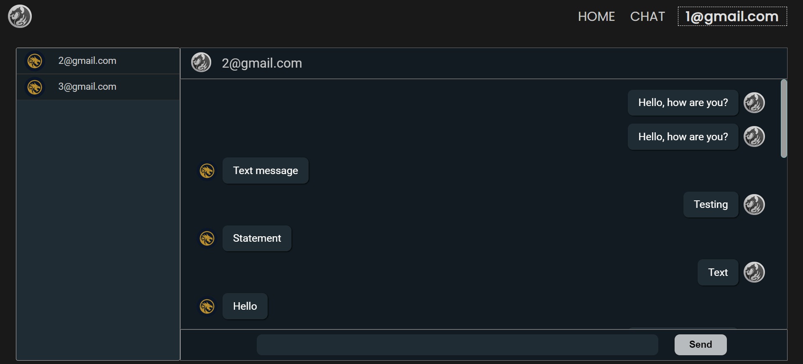

# ChatApp Website

Welcome to the ChatApp website repository! This project showcases a chat application built using a stack of modern technologies including ReactJS, Redux, Next.js, Express.js, MySQL, and more. The ChatApp allows users to communicate with each other in real time, providing a seamless and interactive chatting experience.

## Features

- Real-time messaging
- User authentication and registration
- Message notifications
- User profiles and avatars
- Chat rooms and private messaging


## Screenshots




## Installation

1. Clone the repository:

```bash
git clone https://github.com/SujitAkulwar/Chat-App
```

2. Navigate to the project directory:

```bash
cd chatapp
```

3. Install server dependencies:

```bash
cd server
npm install
```

4. Install client dependencies:

```bash
cd ../app
npm install
```

5. Set up MySQL database:

   - Create a MySQL database and user for the ChatApp.
   - Update the database configuration in `server/config/database.js`.
   - Import sql table from sql folder

6. Start the server:

```bash
cd ../server
nodemon index.js
```

7. Start the client:

```bash
cd ../app
npm start
```

8. Open your web browser and visit `http://localhost:3000` to access the ChatApp.

## Usage

1. Register a new account or log in with your existing credentials.

2. Explore the list of available chat rooms or start a private conversation with a user.

3. Send and receive real-time messages within chat rooms.

4. Customize your profile by uploading an avatar and updating your display name.

5. Receive notifications for new messages and private chat requests.

## Technologies Used

- ReactJS
- Redux
- Next.js
- Express.js
- MySQL
- CSS for styling
- Javascript

## Contributing

We welcome contributions to improve this project! To contribute:

1. Fork the repository.

2. Create a new branch for your feature or bug fix:

```bash
git checkout -b feature/your-feature-name
```

3. Make your changes and commit them:

```bash
git commit -m "Add your commit message here"
```

4. Push your changes to your fork:

```bash
git push origin feature/your-feature-name
```

5. Create a pull request on the original repository, explaining your changes and why they should be merged.

Created by [Sujit Akulwar](https://github.com/SujitAkulwar) - [Visit My Portfolio](https://sujitakulwar.github.io/)